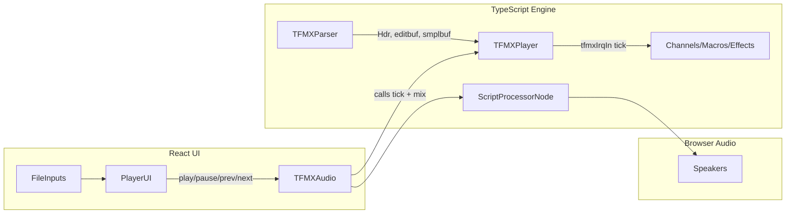

# TFMX Music Player in TypeScript + React

## Overview

Port the C-based TFMX player ([`resource/tfmxplay-1.1.7/src/player.c`](resource/tfmxplay-1.1.7/src/player.c)) to TypeScript, integrate it with the Web Audio API for browser playback, and wrap it in a React UI with file selection and transport controls.

## Browser Constraint: File Loading

Browsers cannot infer and auto-load a second file from a path. We will provide **two file-input buttons** (one for MDAT, one for SMPL). The UI will hint at the naming convention (`mdat.xxx` / `smpl.xxx`) to guide the user.

## Project Structure

```
app/
  src/
    tfmx/                  # Pure TypeScript engine (no React dependency)
      types.ts             # Type definitions (Hdb, Mdb, Cdb, Pdb, Pdblk, Idb, Hdr, UNI)
      constants.ts         # Note period table, magic strings
      TFMXParser.ts        # Binary parser for MDAT header + data, SMPL loading
      TFMXPlayer.ts        # Core player engine (tick-based: macros, tracks, effects)
      TFMXAudio.ts         # Web Audio API bridge: ScriptProcessorNode mixing & output
      index.ts             # Public API surface
    components/
      PlayerUI.tsx          # React component: file inputs, transport, track info
      PlayerUI.css          # Dark theme styling
    App.tsx
    main.tsx
    index.css
  index.html
  package.json
  tsconfig.json
  vite.config.ts
```

## Architecture



## Key Porting Decisions

1. **Endianness**: The Amiga MDAT files are big-endian. Use `DataView` to read big-endian uint16/uint32 values directly. The C code uses `ntohl`/`ntohs` throughout -- in TypeScript we handle this at parse time so the engine works with native numbers.

2. **UNI union**: The C code uses a `UNI` union to access a 32-bit value as bytes or words. In TypeScript, we created a `UNI` class with getters/setters: `b0 = (val >>> 24) & 0xFF`, `w1 = val & 0xFFFF`, etc. (big-endian interpretation, matching the Amiga data layout).

3. **Audio mixing**: Port `mix_add` / `mix_add_ov` from [`audio.c`](resource/tfmxplay-1.1.7/src/audio.c) into a `ScriptProcessorNode` callback. The callback calls `tfmxIrqIn()` at the correct rate based on `eClocks` timing, then mixes the 4 (or 8) hardware channels into a stereo `Float32Array`.

4. **Timing**: The C code uses `eClocks` and a CIA-based timing model. We replicate this: each audio callback generates N samples; we track how many samples correspond to one "jiffy" (tick) and call the player engine accordingly.

5. **State management**: All mutable player state (`Mdb`, `Cdb[]`, `Hdb[]`, `Pdblk`) lives in the `TFMXPlayer` class instance. The `TFMXAudio` class owns the player instance and drives it from the ScriptProcessorNode audio callback on the main thread.

## Implementation Steps

### 1. Scaffold Vite + React project
Run `npm create vite@latest` with the React-TS template inside `app/`. Install dependencies.

### 2. Define types and constants
Port all struct definitions from [`player.h`](resource/tfmxplay-1.1.7/src/player.h) and [`tfmxsong.h`](resource/tfmxplay-1.1.7/src/tfmxsong.h) to TypeScript interfaces/classes. Port the `notevals[]` table and the `UNI` byte-extraction helpers to `constants.ts`.

### 3. Implement the MDAT/SMPL parser
Port the file-loading logic from [`tfmxplay.c`](resource/tfmxplay-1.1.7/src/tfmxplay.c) `load_tfmx()` (lines 398-567):
- Read the 512-byte header (`Hdr` struct): magic, text, start/end/tempo arrays, trackstart/pattstart/macrostart pointers.
- Build `editbuf` (the main data buffer) from the rest of the MDAT.
- Resolve pattern and macro pointer tables (convert file offsets to buffer indices).
- Byte-swap trackstep words.
- Load SMPL file as a raw `Int8Array`.

### 4. Implement the core player engine
Port `player.c` function by function into `TFMXPlayer.ts`:
- `AllOff()`, `TfmxInit()`, `StartSong()` -- initialization
- `tfmxIrqIn()` -- main tick entry point
- `DoAllMacros()` / `DoMacro()` / `RunMacro()` -- macro interpreter (the big switch statement, lines 149-516)
- `DoEffects()` -- vibrato, portamento, envelope, fade
- `DoTracks()` / `DoTrack()` / `GetTrackStep()` -- trackstep/pattern sequencer
- `NotePort()` -- note dispatch
- `ChannelOff()`, `DoFade()`

### 5. Implement the audio mixing and output
Port `audio.c` mixing into a Web Audio ScriptProcessorNode callback:
- `mix_add` / `mix_add_ov` -- sample mixing with fixed-point position tracking
- `mixit` -- per-tick channel mixing into left/right buffers
- Timing: convert `eClocks`-based jiffy timing to sample counts at the output sample rate (44100 Hz)
- Stereo blend and optional low-pass filter
- The callback runs the player tick loop and fills its output buffer each `onaudioprocess` call.

### 6. Build the React UI
Create `PlayerUI.tsx` with:
- Two file input buttons ("Load MDAT" / "Load SMPL") that read files via the File API
- Display: song name (from header text), current sub-song number, total sub-songs
- Transport: Play, Pause, Previous Sub-song, Next Sub-song buttons
- State: track which sub-song is selected, whether playback is active
- Style with basic CSS for a clean, modern look

### 7. Integration and testing
- Wire up the full pipeline: file load -> parse -> init player -> start audio -> hear sound
- Test with the Turrican 2 files in [`resource/Turrican_2/`](resource/Turrican_2/)
- Handle edge cases: missing files, invalid formats, sub-song bounds

